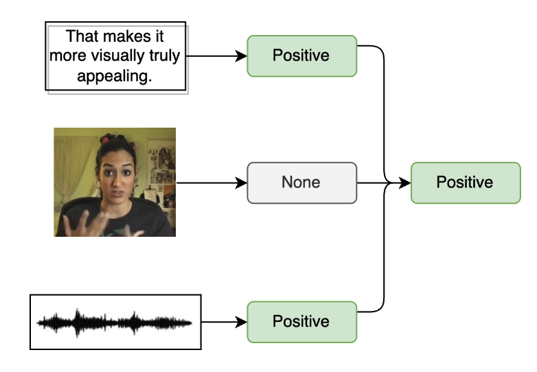

# 实验：多模态情感分析（Multimodal Sentiment Analysis）

## 开始之前
我们在本次实验中使用jupyter Notebook进行实验，
请参考[Jupyter Notebook使用](../lab1/环境配置指南.md#jupyter-notebook)，
按照文档中详细步骤进行操作，完成Jupyter Notebook的配置。

## 实验任务
本次实验包括两个任务：
1. 根据要求补充完整数据集加载、模型搭建、评价指标、模型训练和测试代码。
2. 在任务1的基础上，完成实验结果对比分析、消融实验和新模型设计。

### [任务文档：多模态情感分析](./多模态情感分析.md)

### [任务代码：EXP_MSA.ipynb](EXP_MSA.ipynb){ .md-button}

## 任务描述

本实验的任务是实现一个多模态情感分析模型，该模型能够融合视觉、文本和音频信息，以预测视频片段的情感强度。

具体任务包括：

1. **数据预处理**：加载和处理CMU-MOSI数据集，确保数据的完整性和一致性。
2. **模型设计**：设计一个多模态神经网络模型，包括各模态的特征提取和融合机制。
3. **模型训练**：使用训练数据集训练模型，并在验证集上进行评估，以选择最佳模型。
4. **模型评估**：在测试集上评估模型性能，使用多种指标（如MAE、相关系数等）进行评估。
5. **结果分析**：分析模型的预测结果，讨论模型设计和多模态融合对情感分析性能的影响。

## 实验提交
实验完成后，请提交以下材料：

1. 运行成功的Jupyter Notebook文件
2. 一份PDF报告，报告内容**包括但不限于**：
    1. 任务中的填充代码和相应实验结果
    2. 实验八思考题答案
    3. 实验心得与体会

## 提交说明

1. 本次提交的内容为: 实验八要求提交的内容，具体要求请参见实验网站（https://zhiweinju.github.io/nju-dl-lab-2025spring/）
2. 提交的报告文件请以PDF文件格式上传到selearning网站，上传文件的文件命名格式为: 学号_姓名_实验八.pdf，比如：123456789_张三_实验八.pdf
3. 其他提交文件（如 运行成功的Jupyter Notebook文件），请加上前缀: 学号_姓名_lab8_，比如: 123456789_张三_lab8_MSA.ipynb
4. 本次提交的截止时间为 4月25日23:59:59
5. 对于迟交的处理: 迟交一周以内，折扣系数为0.8，迟交超过一周，折扣系数为0.6，超过一个月停止接收提交，尚未提交者本次作业计0分
